# Light Steel Keel Gypsum Board Partition Wall

1. Regulatory & design requirement
2. Introduction
3. Construction process

## Regulatory

1. **GB50210-2018** => Standard construction quality acceptance of building decoration

## Material

1. Gypsum board
2. Horizontal stud
3. Support clip/bridging clip

## Process

```mermaid
flowchart LR
    A[Layout marking & module division] --> B[Fixed keel along the top & ground]
    B --> C[Fixed frame keel]
    C --> D[Install vertical keel]
    D --> E[Install doors and windows frames]
    E --> F[Install additional keel]
    F --> G[Install support keel]
    G --> H[Concealed wiring pipes]
    H --> I[Install the side cover panel]
    I --> J[Filled with acoustic insulation material]
    J --> K[Install the other side of the cover panel]
    K --> L[Seam and corner protection]
```

