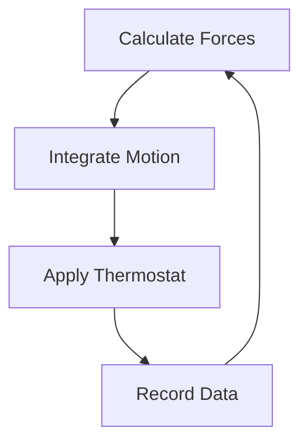

# Sandwich Insulated Wall Panel

1. Regulatory basics and design requirement
2. Materials, accessories materials and construction tools
3. Installation process
4. Installation method
5. Construction method
6. Hole opening & marking method
7. Components Introduction
8. QA & QC 

## 1. Requlatory and design requirement

1. **GB50591-2010** => Code for construction and acceptance of cleanroom
2. **GB50210-2018** => Standard for construction quality acceptance of building decoration

## 2. Materials, accessories materials and contruction tools

1. Frame aggregate/structure
2. Corner plastic material
3. Internal core material
4. Color bond steel cladding panel(with internal adhesive)

### Production Process 

1. Color steel plate is cut and formed
2. The frame aggregate is formed 
3. Mix proportionally and apply adhesive glue
4. Filler core material is insert according to the requirements
5. Press-forming and until adhesive curing
6. Finish product cleaning and packing

### Insulated Panel Classification

1. Rockwool, Aluminium Honrycomb, Paper Honeycomb, PU (Polyurethane)
2. YKE manufact rockwool (double side 0.5mm thick, rockwool density 100kg/m3)
3. Fire resistance rating (1H 5cm or 2H 10cm)
4. Standard panel width : 90cm, 100cm, 120cm
5. Functional Performance such as : Antistatic, Non-conducive, Salt-spray
6. Ceiling installation, using magnesite-rock wool

### Tools
1. Aluminium cutting machine
2. Hand-held cutting machine
3. Laser level
4. Battery drill

## 3. Installation process

1. Base line marking-out
2. Setting our cross control line
3. Parallel refrence line layout
4. Floor track installation
5. Ceiling mounted track installation
6. Wall panel installation
7. Reserve door opening
8. Wall panel protection
9. Wall panel airtight
10. Door and window installation
11. Tear off the the film and silicone apply