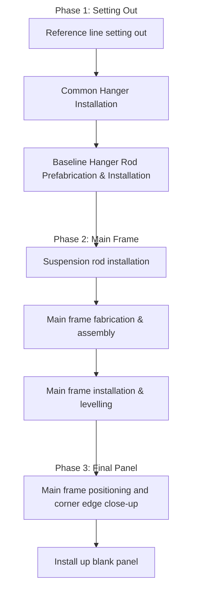

# T-Grid Ceiling

##

## T-Grid Ceiling construction workflow

```mermaid
flowchart TD
    %% Row 1: Left to Right
    subgraph Row1 [Phase 1: Setting Out]
        direction LR
        A[Reference line setting out] --> B[Common Hanger Installation] --> C[Baseline Hanger Rod Prefabrication & Installation]
    end

    %% Connection down to Row 2
    C --> D

    %% Row 2: Left to Right
    subgraph Row2 [Phase 2: Main Frame]
        direction LR
        D[Suspension rod installation] --> E[Main frame fabrication & assembly] --> F[Main frame installation & levelling]
    end

    %% Connection down to Row 3
    F --> G

    %% Row 3: Left to Right
    subgraph Row3 [Phase 3: Final Panel]
        direction LR
        G[Main frame positioning and corner edge close-up] --> H[Install up blank panel]
    end

    %% Hides the border lines of the subgraphs for a clean look
    style Row1 fill:none,stroke:none
    style Row2 fill:none,stroke:none
    style Row3 fill:none,stroke:none
```
